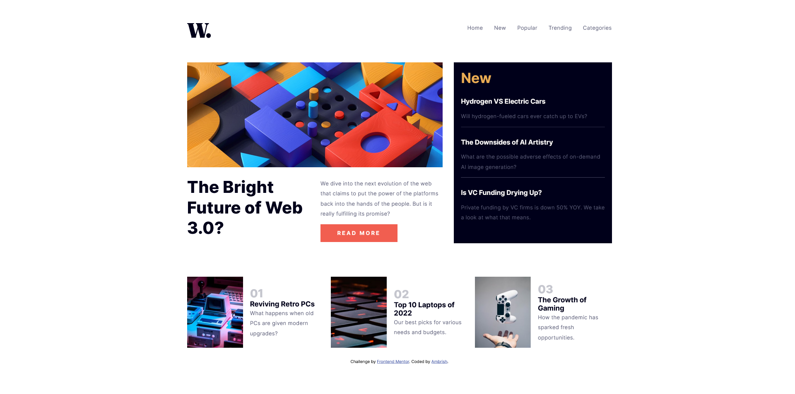

# Frontend Mentor - News homepage solution

This is a solution to the [News homepage challenge on Frontend Mentor](https://www.frontendmentor.io/challenges/news-homepage-H6SWTa1MFl). Frontend Mentor challenges help you improve your coding skills by building realistic projects. 

## Table of contents

- [Overview](#overview)
  - [The challenge](#the-challenge)
  - [Screenshot](#screenshot)
  - [Links](#links)
- [Built with](#built-with)
- [What I learned](#what-i-learned)
- [Useful resources](#useful-resources)
- [Author](#author)


## Overview

### The challenge

Users should be able to:

- View the optimal layout for the interface depending on their device's screen size
- See hover and focus states for all interactive elements on the page
- **Bonus**: Toggle the mobile menu (requires some JavaScript)

### Screenshot




### Links

- Solution URL: (https://github.com/Ambrish-Abhijatya/News-homepage-FrontendMentor-Challenge)
- Live Site URL: (https://your-live-site-url.com)


## Built with

- Semantic HTML5 markup
- CSS custom properties
- Flexbox
- CSS Grid
- Mobile-first workflow


## What I learned

```html
<!-- Learnt about the picture tag -->
<picture>
        <source media="(min-width: 768px)" srcset="./assets/images/image-web-3-desktop.jpg">
        
</picture>
```
```css
/* Learn about the :not() selector  */
.header li:not(:first-child){
        margin-left: 2rem;
    }
```
```js
// Better use JS for the navbar rather than trying to crack one's head with crazy CSS 😅
openMenu.addEventListener('click', ()=> {
    navBar.classList.add('open');
});

closeMenu.addEventListener('click', () => {
    navBar.classList.remove('open');
});
```


## Useful resources

- [MDN Reference](https://developer.mozilla.org/en-US/) - MDN is godsend for web developers.
- [Kevin Powell](https://www.youtube.com/channel/UCJZv4d5rbIKd4QHMPkcABCw) - The only person on the internet who loves CSS(That, I know of).


## Author

- Website - [Ambrish](https://github.com/Ambrish-Abhijatya)
- LinkedIn - [Ambrish Abhijatya](https://www.linkedin.com/in/ambrish-abhijatya-02a679170/)
- Instagram - [@geekywhovianinc](https://www.instagram.com/geekywhovianinc/)

